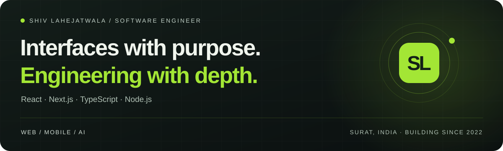

# Hi, I'm Shiv Lahejatwala

**Senior Software Developer & Technical Lead · Surat, India**

Also known as **Shiv Lahejat** — building production web applications since November 2022.

I work at **Multi Code Genius**, where I lead frontend delivery on **ResumeDone** and contribute to products across SaaS, ecommerce, AI and mobile. My work connects the details of an interface with the systems behind it: reusable components, application state, APIs and releases.

**[Explore my portfolio ↗](https://shivlahejat.vercel.app/)** · [LinkedIn](https://www.linkedin.com/in/shiv-lahejatwala-b8a638249/) · [Email](mailto:shivlahejat123@gmail.com) · [Résumé](https://shivlahejat.vercel.app/resume/shiv-lahejatwala-resume.pdf)

---

## Selected work

A few products I've contributed to, with my role and implementation details in each case study.

<table>
<tr>
<td width="50%" valign="top">

### ResumeDone
**SaaS · Frontend Team Lead**

One shared codebase serving multiple resume-builder brands, including CV Lite, CVToolsPro, CV Machine and CV for Success. I guide technical direction, code reviews, the design system, frontend performance and releases.

`React` `Next.js` `TypeScript`

[Explore the platform & my contribution →](https://shivlahejat.vercel.app/work/resumedone)

</td>
<td width="50%" valign="top">

### Meable
**AI product · Full-stack development**

Streaming AI conversations with history and persistent context. I built the chat experience, server-side prompt handling, rate limits and fallback states, plus its supporting marketing website.

`Next.js` `Node.js` `PostgreSQL` `OpenAI API`

[See the application architecture →](https://shivlahejat.vercel.app/work/meable)

</td>
</tr>
<tr>
<td width="50%" valign="top">

### Marova Essence
**Ecommerce · Full-stack development**

A fragrance storefront connecting product browsing and checkout with Sanity-managed content, backed by Node.js and Express services on GCP.

`Next.js` `Sanity` `Node.js` `GCP`

[Explore the storefront →](https://shivlahejat.vercel.app/work/marova-essence)

</td>
<td width="50%" valign="top">

### Bombay Canvas
**Entertainment · Web & mobile contributions**

A website presenting short-form series and branded-show case studies, alongside contributions to the React Native application for iOS and Android.

`Next.js` `React Native`

[See the web & mobile work →](https://shivlahejat.vercel.app/work/bombay-canvas)

</td>
</tr>
</table>

More work: [Match Kicks](https://shivlahejat.vercel.app/work/match-kicks) · [Blip](https://shivlahejat.vercel.app/work/blip) · [IoT Dashboard](https://shivlahejat.vercel.app/work/iot-dashboard) · **[All projects →](https://shivlahejat.vercel.app/work)**

## How I contribute

- **Build the product:** responsive, accessible interfaces; reusable React components; clear loading, empty and error states.
- **Connect the system:** API integrations, authentication, shared application state and streamed AI responses.
- **Lead the delivery:** review code, mentor engineers, guide frontend architecture and coordinate releases.
- **Work with clients:** turn requirements into scope, priorities and implementation plans.

## Tools I work with

| Area | Technologies |
| :--- | :--- |
| Web & mobile | React, Next.js, React Native, TypeScript, JavaScript |
| Interface & state | Tailwind CSS, styled-components, Redux Toolkit, Zustand |
| Backend & data | Node.js, Express, REST, GraphQL, PostgreSQL, MongoDB |
| Product & delivery | Shopify Hydrogen, Sanity, OpenAI API, Git, Docker, GCP, Vercel |

## Engineering notes

I write about the implementation decisions behind the interface: shared React components, streaming AI experiences and responsive data-heavy applications.

**[Read my engineering notes →](https://shivlahejat.vercel.app/notes)**

---

### Have a product or engineering challenge in mind?

[Start a conversation](https://shivlahejat.vercel.app/contact) or email **[shivlahejat123@gmail.com](mailto:shivlahejat123@gmail.com)**.

I use <a href="https://github.com/shivlahejatwala">@shivlahejatwala</a> for my ResumeDone work · Portfolio: <a href="https://shivlahejat.vercel.app/">shivlahejat.vercel.app</a>
